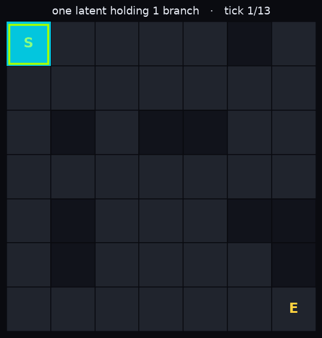

# langset — fine-tune an LLM to work in latent space

**langset few-shot fine-tunes a pretrained LLM to *read text and answer in a vector*.** Bolt a tiny head onto
the backbone, describe the geometry you want in words, and the LLM's own world knowledge does the reading — the
latent lives in the model's *own* hidden space, so it's your embedding, not a re-projection of an off-the-shelf
one. One method, two things you can build with it:

* **single-latent → a bespoke embedding model.** One vector per input, in a geometry you define. Drops straight
  into SetFit as a Sentence-Transformer body. *(This README's running example.)*
* **multi-latent → a JEPA world model.** The LLM emits a *sequence* of latents in its own token stream — one per
  step, with a learned STOP — and each latent holds a **calibrated superposition** of possible next states. It
  *predicts in latent space*, which is the thing people say LLMs can't do without a separate world model. Here
  the LLM **is** the world model. → **[examples/maze-superposition](examples/maze-superposition)**

<p align="center">
  
</p>

<p align="center"><em>A trained multi-latent langset model as a world model — each tick is one emitted latent
holding a whole <strong>set</strong> of next states (the lime frontier), the caption counting how many. See
<a href="examples/maze-superposition">the superposition example</a>.</em></p>

## The one idea (both modes)

**The `target_text` *is* the geometry.** Whatever your target descriptions describe becomes the axis your
latent space measures — and nothing else. Describe instrumentation and the space clusters by instrumentation;
describe vocals and emotion and it clusters by vocals and emotion. You don't discover the geometry, you
**define** it — and you re-steer it by rewriting the target text, no model changes.

What makes langset different:

* 🎯 **Latent out, not a label.** You define the output space; the model answers in a *vector*. Retrieval,
  "find similar", ranking, clustering — classification is just one thing you can do downstream.
* 🧭 **You design the axis in words.** The target text defines the geometry. Point it at the signal you care
  about (and at something the input text can't trivially regenerate, or you're just distilling a text encoder).
* 🧠 **World knowledge does the work.** It's a generative LLM, so it generalizes from *hundreds* of examples,
  not millions — it *reads* the input rather than pattern-matching surface tokens.
* 🪞 **Your own embedding.** The latent lives in the model's own hidden space; the geometry comes from a
  self-contrastive objective against your target text — no external encoder in the loop.

## Install

```bash
pip install langset
```

## Usage

A langset dataset is rows of `input_text` → `target_text`. Pick an LLM backbone; langset trains the mapping.

```python
from langset import LangSetModel, Trainer, TrainingArguments

rows = [  # what you'll have at inference -> a description that DEFINES where it should land
    {"input_text": "an hour-long track of detuned riffs that never break stride, moving at the pace of continental drift",
     "target_text": "glacial detuned doom-metal, sludgy and hypnotic, buried roared vocals"},
    {"input_text": "chopped vocal ghosts drifting over vinyl crackle and the hiss of a city at 3am",
     "target_text": "crackly nocturnal UK garage, pitched vocal ghosts, wistful and restless"},
    # ...
]

model = LangSetModel.from_pretrained("HuggingFaceTB/SmolLM2-135M")   # any HF causal LM
Trainer(model, TrainingArguments(), train_dataset=rows).train()

z = model.encode(["a wall of downtuned fuzz that buries the vocals under sheer volume"])
print(z.shape)   # (1, 576)  — a latent in the backbone's own space
```

See [`examples/sounds_like/`](examples/sounds_like/) for the full reference task (album review → "how it
sounds" latent).

## How it works

1. **Self-contrastive.** For each row, `emit(input_text)` is trained to match `emit(target_text)` — *both*
   emitted through the model into its own space — against in-batch negatives. The target text defines where
   each item lands; the negatives force different items apart (so the space can't collapse).
2. **Grounding aux.** A light reconstruction term makes the latent also *decode* the target text, tying it to
   the words. A light uniformity term keeps the space spread on the sphere.
3. **Collapse-aware selection.** langset early-stops on held-out input↔target retrieval and reconstruction,
   with a hard penalty on any collapse of the geometry — never on the training loss (which collapse can game).

## Dataset contract

| column | meaning |
|---|---|
| `input_text` | what you'll have at inference (a name, a query, a review) |
| `target_text` | a description of the same item that **defines** where it lands (the geometry) |

`Trainer` accepts a `datasets.Dataset` or `list[dict]`; use `column_mapping` to rename your columns.

## Using with SetFit

The name is the chain: **lang·set·fit** — a *language* model emits into the *set* geometry (langset, usable on
its own), which then *fit*s a classifier. `model.as_sentence_transformer()` is a drop-in
[SetFit](https://github.com/huggingface/setfit) `model_body`, so you can train a few-shot classifier directly
on your bespoke geometry.

The clean distinction: **SetFit answers with a *label*; langset answers with a *latent*.**

| | reach for **SetFit** | reach for **langset** |
|---|---|---|
| your answer is | a **label** (fixed classes) | a **point in a space** — retrieval, "find similar", ranking, clustering |
| you define the target by | enumerating classes | a **description** of the geometry ("how it sounds") |
| your input | text to classify | text *or an identifier* — leans on the LLM's world knowledge |

- **Use SetFit alone** for plain few-shot classification — you won't beat it by bolting on langset.
- **Use langset** when the answer is a *geometry, not a label* (you'll retrieve / rank / cluster in it).
- **Use langset → SetFit** when a task-shaped body helps the classifier.

```bash
pip install "langset[setfit]"      # pins the verified composition window (below)
```
```python
from sklearn.linear_model import LogisticRegression
from setfit import SetFitModel

clf = SetFitModel(model_body=langset_model.as_sentence_transformer(),
                  model_head=LogisticRegression(max_iter=2000),    # direct construction needs an explicit head
                  labels=[...])
clf.fit(x_train, y_train, num_epochs=1)        # frozen body + head — the robust path
clf.predict(["..."])
```

**Dependency alignment.** SetFit's pins are loose, so versions matter:

| install | transformers / torch | Python | use |
|---|---|---|---|
| `langset` | latest (≥4.41) | 3.10+ | modern backbones incl. **Qwen3**; no SetFit |
| `langset[setfit]` | **4.46.x / <2.5** | **3.10–3.12** | verified SetFit composition |

SetFit imports `transformers.training_args.default_logdir` (removed after 4.46), and 4.46 + torch≥2.5 trips a
`torch.distributed.tensor` bug — hence the cap. Use the frozen-body `SetFitModel.fit`/`predict` path above; the
full `setfit.Trainer` (fine-tunes the body) is fragile in this window.

## Multi-latent — one input, a *set* of latents

Everything above emits **one** latent per input. Multi-latent emits a **variable-length set** — one latent per
distinct item in the input — autoregressively, with the model deciding *how many* via a learned STOP. Each
latent lands in the same bespoke geometry, so you decode it the same way you'd decode a single one (nearest
neighbor against a bank, a downstream head, whatever).

**Why:** a single vector is the wrong shape whenever one input contains an unknown number of things. Collapse
*"Apple and Microsoft partnered in California"* into one embedding and you've blended three items into one
blurry point. Multi-latent keeps them separate — three latents, each retrievable on its own — and, unlike a
fixed-slot head, it doesn't need you to know the count in advance.

**The headline use case is a JEPA world model.** When the *set* is the set of possible **next states** — and
each step's target literally is that set — a multi-latent model learns to emit a **calibrated superposition**:
one latent that holds several admissible futures at once, with its own entropy tracking how open the future is.
That's prediction in latent space (JEPA), done by the LLM itself rather than a separate world model bolted
alongside it. The **[maze-superposition example](examples/maze-superposition)** trains and *measures* exactly
this (with [`langset.probes`](src/langset/probes.py)); the anti-collapse machinery that makes it work — the
[EMA target twin and SIGReg/LeJEPA](#anti-collapse-ema-twin-default-vs-sigreg-lejepa) — is the same JEPA
apparatus described below.

The other things a variable-length latent set is good for:

* **Multi-item extraction** — entities, keyphrases, skills, ingredients: read a document, emit a latent per
  item, retrieve each against a reference bank. ([`examples/ner-multi-latent/`](examples/ner-multi-latent/)
  does exactly this for named entities.)
* **Multi-vector retrieval** — represent a query or document as a *set* of latents (ColBERT-style late
  interaction) instead of one averaged vector, for finer-grained matching.
* **Multi-aspect / multi-label** — one latent per facet (a product's `{brand, category, material}`) or per
  applicable label, instead of one vector forced to mean several things at once.
* **Multi-intent parsing** — an utterance carrying several intents → a latent each.

```python
from langset import LangSetModel
import torch.nn.functional as F

m = LangSetModel.load("path/to/checkpoint", device="cpu")

# a reference bank you retrieve emitted latents against (any short label works)
bank = ["PER: Barack Obama", "LOC: Berlin", "PER: Angela Merkel", "ORG: Apple", "LOC: California"]
zb = F.normalize(m.emit(bank).float(), dim=-1)                       # [N, d]

# emit a VARIABLE-length set from one input — the count is decided by a learned STOP
lat = F.normalize(m.rollout("Barack Obama visited Berlin to meet Angela Merkel.").float(), dim=-1)
for v in lat:                                                        # -> one latent per entity
    print(bank[int((v @ zb.T).argmax())])                           # PER: Barack Obama / LOC: Berlin / PER: Angela Merkel
```

Train it with the same `Trainer` — a multi-latent model reads rows of `{input_text, target_texts: [...]}` (a
*list* of targets per input) instead of a single `target_text`:

```python
from langset import LangSetModel, Trainer, TrainingArguments

rows = [{"input_text": "Barack Obama visited Berlin to meet Angela Merkel.",
         "target_texts": ["PER: Barack Obama", "LOC: Berlin", "PER: Angela Merkel"]},
        # ...
       ]
model = LangSetModel.from_pretrained("Qwen/Qwen3-0.6B-Base", multi_latent=True)  # FSQ set-emission head
Trainer(model, TrainingArguments(epochs=15), rows).train()
```

Under the hood each latent is finite-scalar-quantized (FSQ) into per-dimension digits the model predicts, an
EMA target twin (stop-grad) supplies the target latents so the set can't collapse, and every emitted latent is
fed back into the stream so the next one is conditioned on those already emitted.

### Anti-collapse: EMA twin (default) vs SIGReg (LeJEPA)

By default the multi-latent path prevents representation collapse with an **EMA target twin** — a stop-grad
copy of the model whose slowly-moving latents are the targets, so the online model can't trivially match a
target that moves with it. Injecting `target_source=SIGRegTarget` swaps this for **SIGReg** (Sketched Isotropic Gaussian
Regularization, from LeJEPA, [Balestriero & LeCun 2025, arXiv:2511.08544](https://arxiv.org/abs/2511.08544)):
no twin, no stop-grad — targets come from the *live* encoder, and collapse is prevented instead by
regularizing the pre-quantization latent `z = down_proj(·)` toward an isotropic Gaussian (an Epps–Pulley
goodness-of-fit test over random 1-D projections). The isotropic Gaussian is the distribution LeJEPA proves is
uniquely privileged for downstream identifiability ([arXiv:2605.26379](https://arxiv.org/abs/2605.26379)).

```python
from langset.strategies import SIGRegTarget
Trainer(model, TrainingArguments(target_source=SIGRegTarget, sigreg_lambda=0.3), rows).train()
```

Anti-collapse is chosen by *injecting a different target-source strategy*, not a boolean flag — the default
`target_source=EMATwinTarget` and `SIGRegTarget` are interchangeable implementations (see `strategies.py`).

**Trade-offs:**

| | EMA twin (default) | SIGReg (`target_source=SIGRegTarget`) |
|---|---|---|
| memory | a full frozen copy of the backbone in VRAM | none — no twin |
| per-step cost | one extra target forward | one Gaussian-regularizer pass (cheap) |
| anti-collapse | stop-grad target | isotropic-Gaussian penalty on pre-quant `z` |
| separation term | pairs with in-batch InfoNCE (`lam_multi_nce`) | replaces it (InfoNCE auto-gated off) |

Empirically SIGReg **matches or beats** the twin on *local* calibration but retains a small gap on *global*
structure at high `sigreg_lambda`; **tune `sigreg_lambda` ≈ 0.3** (over-diversification washes out global
structure; too small under-constrains). Implementation note (see `sigreg.py`): the test is **center-only, not
standardized** — standardizing per-dim before the Gaussianity test is scale-invariant and silently defeats
anti-collapse (a collapsed batch passes with zero gradient). SIGReg is research-grade; the EMA twin remains
the validated default.

### Continuous emission — `ContinuousObjective`

By default multi-latent quantizes each emission to FSQ digits (a discrete token). The continuous path keeps
the same variable-length, STOP-terminated, fed-back latent-set structure but emits a **raw continuous vector**
(`out_proj`), trained by cosine to the target with a BCE STOP head instead of digit cross-entropy.

Two pieces select it: the **model** is built with the continuous head (`continuous_emit=True` — a head-architecture
property, chosen at `from_pretrained`), and the **trainer** is given the continuous emission strategy by *injecting*
`emission=ContinuousObjective` (interchangeable with the default `FSQObjective`, see `strategies.py`):

```python
from langset.strategies import ContinuousObjective
model = LangSetModel.from_pretrained("...", multi_latent=True, continuous_emit=True)
Trainer(model, TrainingArguments(emission=ContinuousObjective), rows).train()
```

**Why:** a discrete argmax emission can only name *one* future, so when an input admits several plausible next
latents the digit head can't represent the *mixture*. A continuous emission can settle at the **centroid of the
admissible futures** — calibrated superposition, the one-to-many property that motivates Large Concept Models'
diffusion-over-next-concept ([Meta LCM, arXiv:2412.08821](https://arxiv.org/abs/2412.08821)); it is also the
regime the isotropic-Gaussian identifiability result assumes ([arXiv:2605.26379](https://arxiv.org/abs/2605.26379)),
which a bounded discrete lattice does not satisfy.

**Trade-offs:** you gain the ability to represent a calibrated distribution over futures, but you give up the
token-native discreteness — emissions are no longer in-vocabulary digits sharing the softmax/CE machinery, and
the FSQ grid no longer provides *free* anti-collapse, so lean on the EMA twin (or SIGReg) and watch the
`distinct` diversity count. Use `ContinuousObjective` when the target is genuinely one-to-many; stay on the default
FSQ when you want the discrete token interface (e.g. to co-train text and latents in one stream).

### CoT-conditioned emission — `build_cot_loss_terms` + `cot_seed_texts`

By default the model emits latents straight from the input seed. Injecting the CoT strategy pair inserts a
**chain-of-thought step**: the model is co-trained to *generate* a per-row reasoning string (a `cot_text` column)
before it emits the latents, and the latent forward is conditioned on `seed + CoT`. Two objectives share one
optimizer step — the FSQ latent loss, and a next-token cross-entropy on the CoT string (weight `lam_cot`) through
the tied embedding, i.e. the **same CE machinery the latents already use**.

It's selected by *injecting two strategies* (not a flag): `loss_terms=build_cot_loss_terms` adds the isolated
`CoTGenTerm`, and `seed_builder=cot_seed_texts` conditions the emission on the reasoning:

```python
from langset.strategies import build_cot_loss_terms, cot_seed_texts
rows = [{"input_text": "...", "target_texts": ["...", "..."], "cot_text": "step-by-step reasoning ..."}, ...]
model = LangSetModel.from_pretrained("Qwen/Qwen3-1.7B-Base", multi_latent=True)
Trainer(model, TrainingArguments(loss_terms=build_cot_loss_terms, seed_builder=cot_seed_texts, lam_cot=1.0),
        rows).train()
```

**Why:** some target latents aren't a direct function of the surface input — they need an intermediate
inference the model can do but doesn't surface in one hop. Letting the model *think in tokens first*, then emit,
lets that reasoning inform the latent, in the spirit of chain-of-thought reasoning
([Wei et al., arXiv:2201.11903](https://arxiv.org/abs/2201.11903)) — but here the reasoning and the latent are
co-trained in **one token stream** rather than the reasoning being an external prompt, and unlike COCONUT's
continuous latent thoughts ([Hao et al., arXiv:2412.06769](https://arxiv.org/abs/2412.06769)) the CoT stays in
readable token space sharing the softmax/CE interface.

**Trade-offs:** the two forward+backward passes run *separately* so their autograd graphs never coexist (peak
activation is `max(latent, cot)`, not the sum) — but you still pay a second forward per step, and CoT blocks are
long (train-time cost scales with CoT length, not the short latents). You need a `cot_text` column: at train
time it's a teacher-forcing target; the measured result is the *lift* from the model learning to produce its own
CoT (self-generated reasoning helps even when the CoT text itself came from a stronger teacher, which is not a
fair ceiling to compare against). Without the injected strategies (or with an absent `cot_text` column) the path
is byte-identical to the plain FSQ emission — `CoTGenTerm` self-skips on empty reasoning.

### Superposition — one seed, several alternative futures

When a single input seed admits **several alternative futures** — its `target_texts` are competing branches of
*one* state, not disjoint items — the default in-batch objective pushes those branches apart, forcing the
emitted latent to commit to one. Injecting the superposition strategy triple lets it instead represent the
calibrated **mixture** over branches (its uncertainty), the token-space analogue of predicting a distribution
over next states:

| injected strategy | effect |
|---|---|
| `epoch_order=grouped_epoch_order` | orders each epoch so a seed's branches are **contiguous**, so they *tend to share a batch* (guaranteed only when `batch_size` ≥ the per-seed branch count and the groups align — contiguity alone doesn't stop a group straddling a batch boundary); when they do co-occur, their per-target digit-CE sums within the batch ≈ a soft cross-entropy toward the branch mixture `P_mix` |
| `loss_terms=build_superposition_loss_terms` | adds `same_seed_mask` to the in-batch InfoNCE, treating two branches of the **same seed** as false-negatives (not pushed apart), so the emitted latent may settle at their **centroid** (the mixture) rather than being repelled from it |
| `selector=last_epoch_selector` | keeps the **last epoch** instead of early-stopping on `retr_mrr` (see below) |

```python
from langset.strategies import build_superposition_loss_terms, grouped_epoch_order, last_epoch_selector
Trainer(model, TrainingArguments(loss_terms=build_superposition_loss_terms,
                                 epoch_order=grouped_epoch_order,
                                 selector=last_epoch_selector), rows).train()
```

Without these injections the default strategies treat branches as independent items (byte-identical to the
standard multi-latent path). Use them only when branches of one seed genuinely share a state and you want the
emission to be a *distribution*, not a pick. This is the property a discrete FSQ argmax can only approximate as a
mixture of codes; see also [`ContinuousObjective`](#continuous-emission--continuousobjective) for a raw-vector centroid.

Why `last_epoch_selector`: the default checkpoint selection (`retr_mrr`) rewards a *collapsed* one-future-per-seed
geometry, which is exactly the wrong signal here — under superposition training you *want* retrieval MRR to fall
as the latent spreads over a seed's alternatives, so keep the last epoch rather than early-stopping on it. There
is also a plain `snapshot_every=N` scalar knob that saves the online weights to `{output_dir}_ep{N}`,
`{output_dir}_ep{2N}`, … after every N epochs — independent of the eval cadence, separate from the best-so-far
restore — to keep a checkpoint trajectory for offline evaluation.
